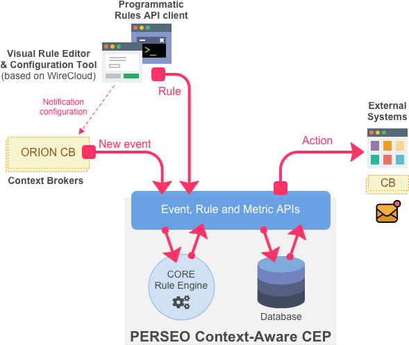

# Perseo Context-Aware CEP

## Overview

Perseo is a Complex Event Processing (CEP) software that implements a simplified version of the CEP GE Open Specification and Architecture. It has been designed to be *NGSI*-compliant, using it as the communication protocol for events, and thus, Perseo is able to seamless and jointly work with a *context broker* like Orion.

It follows a straightforward idea: listening to events coming from context information to identify patterns described by rules, in order to immediately react upon them by triggering actions.

By leveraging on the [notifications mechanism](http://fiware-orion.readthedocs.io/en/latest/user/walkthrough_apiv2/index.html#subscriptions), clients instruct Orion CB to notify Perseo of the changes in the entities they care about (`Event API`). Details of this process are explained in the [Orion Subscription part of the User Manual](user/index.md#orion-subscription). Then, rules to the CORE Rule Engine can be easily managed using the publicly available WireCloud operational dashboard, or making use of any of the REST clients able to programmaticly use the Perseo's `Rule API`. These rules will identify patterns that will trigger actions with Orion to create or update entities, or with other different components or external systems, such as Web (HTTP), Email (SMTP) or SMS (SMPP) servers.

### More information

- Refer to the [Admin Guide](docs/admin/index.md) for info on how to install Perseo and get it running.
- Refer to the [User Manual](docs/user/index.md) for more info on how to use it.
